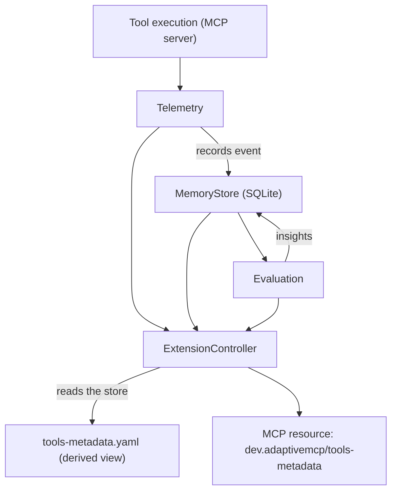

# Architecture

The adaptation loop runs entirely on the client/runtime side. Adaptive MCP is a
learning layer over MCP primitives — it does not replace MCP, redefine tools, or
introduce new protocol abstractions.

## The loop



Data always flows in one direction: **event → MemoryStore → derived
YAML view**. The YAML is never edited directly; it is recomputed from the store
whenever metadata changes.

## Design constraints

- **MCP sets the contract; Adaptive MCP learns the behavior.** MCP answers *"what
  can the model do?"*; Adaptive MCP answers *"what have we learned about how those
  capabilities are actually used?"* and turns that into metadata, not new
  primitives.
- **Enrich, don't replace.** No first-class `adaptiveTool`, `adaptiveSkill`,
  `adaptiveIntent`, or `adaptiveWorkflow` concepts. Adaptive MCP operates on MCP
  primitives (tools, resources) as intentional boundaries.
- **Avoid coupling to implementation details.** Packages must not depend on
  shell, filesystem paths, processes, sockets, or HTTP as first-class concepts.
  Those remain implementation details of the host.
- **Middleware is operational machinery.** Telemetry, evaluation, memory,
  routing, and approval exist to observe, evaluate, remember, route, and
  recommend. Business logic belongs in middleware packages; the client stays
  thin.
- **Stateless servers, accumulating clients.** MCP servers are lightweight and
  replaceable. Clients accumulate knowledge in a local source of truth.

## Relationship to MCP

> **Unofficial project.** Adaptive MCP is an independent, personal experiment.
> It is **not** affiliated with, endorsed by, or maintained by the Model Context
> Protocol project, its stewards, or any vendor. The `dev.adaptivemcp/` extension
> namespace is a reversed-domain identifier of the project domain (`adaptivemcp.dev`)
> and is used in the spirit of, but not as part of, any official MCP extension.

The [Model Context Protocol (MCP)](https://modelcontextprotocol.io) is an open
standard that lets applications provide context and capabilities (tools,
resources, prompts) to language models in a uniform way. Adaptive MCP builds on
MCP rather than beside or beneath it. It does not fork, extend, or replace the
protocol; it observes how MCP tools are actually used and attaches learned
metadata (annotations, insights, recommendations) to the **existing** MCP
primitives.

- MCP servers stay standard and stateless; Adaptive MCP adds a client-side
  learning loop and a single derived resource (`dev.adaptivemcp/tools-metadata`)
  that a server *may* publish to **govern** tool adaptation.
- The pattern is a server-governed resource that clients read and report
  against, degrading gracefully on any host that ignores it. The draft proposal
  lives at [`docs/sep-2133-tools-metadata.md`](https://github.com/kemalelmizan/adaptive-mcp/blob/main/docs/sep-2133-tools-metadata.md).

## Data model

All metadata is persisted in a SQLite store (`node:sqlite`). The schema is a
single `tools` table keyed by `tool_name`:

| Column | Type | Contents |
| --- | --- | --- |
| `tool_name` | TEXT (PK) | Tool identifier |
| `server_name` | TEXT | Originating MCP server |
| `annotation` | JSON | Static, human-written `Annotation` |
| `insights` | JSON | Learned `Insight[]` |
| `recommendations` | JSON | Suggested `Recommendation[]` |
| `stats` | JSON | Accumulated `ToolStats` |
| `updated_at` | TEXT | ISO-8601 timestamp |

### Core types (`@adaptivemcp/spec`)

- **`Annotation`**: static, human-authored metadata (`risk`, `owner`, `tags`,
  `description`). Never changes on its own.
- **`Insight`**: learned from observed behavior (`key`, `value`, `confidence`,
  `source` of `evaluation` or `telemetry`, `sampleSize`). Upserted by key.
- **`Recommendation`**: suggested adaptation (`type` of
  `model`, `approval`, `workflow`, or `routing`, plus `payload`, `rationale`,
  `confidence`). Written by the routing/orchestration/approval packages.
- **`ToolStats`**: `invocations`, `failures`, `failureRate`, `avgDurationMs`,
  `totalCost`, `lastObservedAt`. Folded from each execution event.
- **`ToolRecord`**: the aggregate row (`toolName`, `serverName`, `annotation`,
  `insights`, `recommendations`, `stats`, `updatedAt`).

### Derived YAML view (`tools-metadata.yaml`)

The `ExtensionController` projects each `ToolRecord` into a `ToolMetadataView`
and serializes the document with `js-yaml`. The view is the machine- and
human-readable projection consumed by out-of-band MCP clients.

## Adaptation behaviors

- **Routing** (`Router.routeTool`): picks the cheapest model meeting the
  observed latency/failure profile; emits a `routing` recommendation when a
  tool/server approaches or exceeds its cost budget (≥ 80% of limit).
- **Orchestration** (`Orchestrator.planTool`): when `failureRate ≥
  flakyThreshold` (default 0.1), writes a `workflow` recommendation with a retry
  policy scaled to the failure rate (capped at `maxAttempts = 6`).
- **Approval** (`ApprovalGate.gate`): returns `deny` for denied tools,
  `require_confirmation` for high-risk annotations or flaky tools (failure rate
  ≥ `flakyFailureRate`, default 0.2, after `minInvocations`), else `allow`.
  Writes an `approval` recommendation with `payload: { decision }`.
- **Thin client** (`ThinClient.run`): consults the gate, then executes with the
  store-derived retry policy (or default). Records the outcome back to the store.

## `AdaptiveRuntime`

`AdaptiveRuntime` wires every package into a single transport-agnostic runtime:

```text
tool call -> telemetry -> MemoryStore -> evaluation -> insights
                                                   -> routing       -> recommendations
                                                   -> orchestration -> recommendations
                                                   -> approval      -> gate + recommendation
                                                   -> ExtensionController -> YAML view
```

This is the operational machinery; it is intentionally transport-agnostic.
