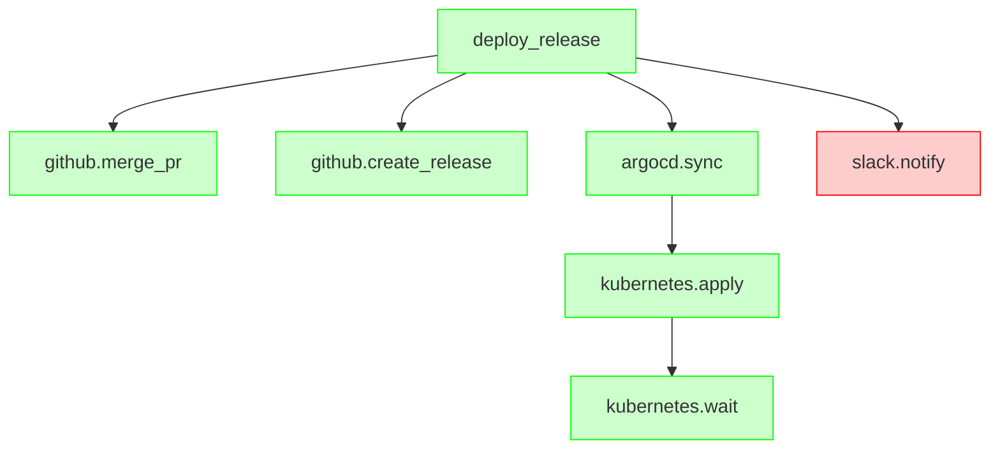

# Execution Graph Explorer

Adaptive MCP's execution graph tracks every tool invocation as a node in a
directed acyclic graph (DAG), with edges linking parents to the children they
spawned. This page shows the same sample `deploy_release` workflow two ways:
a static diagram for the mental model, and an interactive explorer for
digging into individual nodes.

The sample data matches the canonical `ExecutionGraphResource` wire schema
(`@adaptivemcp/spec`) that a real MCP server emits from the
`dev.adaptivemcp://execution-graph/{sessionId}` resource — see
[Architecture](/guide/architecture) for where that fits in the adaptation
loop.

## Static view (Mermaid)

This is exactly what a server-generated Mermaid export looks like — see
`ExtensionController.executionGraphMermaidResourceText` in `@adaptivemcp/extension`
(and its GraphViz DOT counterpart, `executionGraphDotResourceText`, for
tooling that prefers `dot`/`neato` over Mermaid).

## Interactive view (D3)

Drag nodes to reposition them, scroll or pinch to zoom, and click a node to
see its duration, cost, model, and status.

<GraphExplorer />

The `slack.notify` node is red because it's a real Adaptive MCP concept, not
a rendering quirk: a workflow's root can complete "successfully" for its
critical path while a parallel branch still failed independently — exactly
the kind of distinction `GraphAnalyzer.getCausalCascade` (root causes vs.
symptoms) and `detectAntiPatterns` are built to surface. See the
[`debugging-deployment` example scenario](https://github.com/kemalelmizan/adaptive-mcp/blob/main/examples/src/scenarios/debugging-deployment.ts)
for a full walkthrough of a *failed* deployment using both of those.
