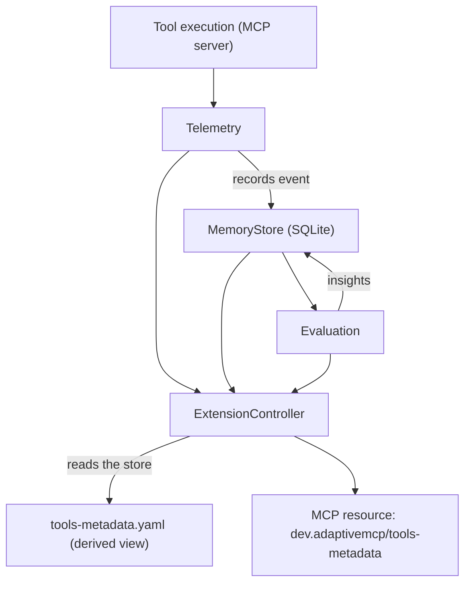

---
# https://vitepress.dev/reference/default-theme-home-page
layout: home

hero:
  name: "Adaptive MCP"
  text: "Turn MCP usage into learned metadata"
  tagline: A learning layer over MCP primitives. Clients adapt from real signal instead of guessing.
  actions:
    - theme: brand
      text: Getting Started
      link: /guide/getting-started
    - theme: alt
      text: Packages
      link: /packages

features:
  - title: A learning layer, not a new protocol
    details: Adaptive MCP observes how MCP tools are actually used and attaches learned metadata to existing primitives. It does not replace MCP, redefine tools, or add protocol abstractions.
  - title: The store is authoritative
    details: All metadata lives in a SQLite store (node:sqlite). The tools-metadata.yaml view is a derived projection, recomputed whenever metadata changes — never edited by hand.
  - title: Server governs, client executes
    details: The server publishes a narrow, server-governed resource (dev.adaptivemcp/tools-metadata). The client learning machinery reads it, adapts, and reports observations back, degrading gracefully on any host that ignores it.
  - title: Modular, dependency-light packages
    details: Ten published @adaptivemcp/* packages — spec, memory, telemetry, evaluation, extension, runtime, routing, orchestration, approval, and thin-client.
---

## What it is

Adaptive MCP is a runtime ecosystem that learns how MCP tools are actually used
and helps runtimes adapt to that behavior over time. It does **not** replace MCP,
redefine tools, or introduce new protocol abstractions. Instead it observes tool
usage, attaches learned metadata to existing MCP primitives, and lets clients
govern themselves from real signal.

> **Status:** experimental. The packages are published, but the API may shift
> before 1.0.

## The adaptation loop



Data always flows in one direction: **event → MemoryStore → derived
YAML view**. The YAML is never edited directly; it is recomputed from the store
whenever metadata changes.

## Quick start

Requires **Node 22+** (Node 26 recommended) and **pnpm 11+**.

```bash
git clone https://github.com/kemalelmizan/adaptive-mcp
cd adaptive-mcp
pnpm install
pnpm -r run build
```

See the [Getting Started guide](/guide/getting-started) for the full tour, or
browse the [published packages](/packages).

